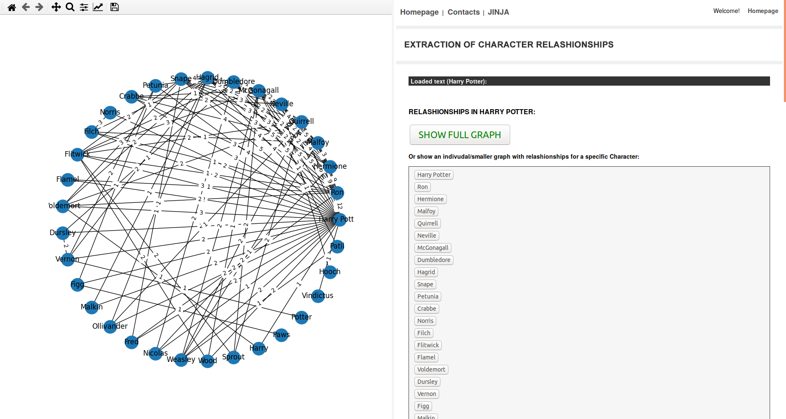

# Tool for dinamic extraction of character relashionships from books #

NLP applied to the first Harry Potter book ("Harry Potter and the Philosopher's Stone"). Set of tools for dinamic generation of character relashionships from the first Harry Potter book corpus (for every proper noun in the same phrase this tool counts it as a relationship), graph visualization of the relationships, and a tool for name manipulation (changing the 3 main protagonists names in all instances in the full book), etc.
This set of tools were made specifically for the first Harry Potter book (full book in raw txt format in the source-code), but should work with any other book with a few adjustements in the code. This is mainly a NLP tool for extracting Proper Nouns and representing them visually, extracting and representing in a graph characters relationship from books, and visually manipulating/dinamic changing characters names.

### Como correr/instalar ###

Para acorrer a aplicação basta iniciar (duplo clique ou via terminal) o ficheiro "main.py" na raiz da aplicação.

É necessária uma versão Python 3.6 ou superior e as seguintes bibliotecas instaladas (exemplo via pip install):

* pip3 install flask
* pip3 install pywebview
* pip3 install networkx
* pip3 install numpy
* pip3 install matplotlib
* pip3 install nltk

Depois de inicializar a aplicação, duas janelas com interface gráfica serão lançadas: a principal, onde se encontram o nome das personagens e opções (Flask+Webview), e uma segunda de apoio onde serão exibidos os grafos seleccionados (Networkx+Matplotlib), por defeito abre um grafo com todas as relações (a janela deverá ser maximizada para melhor visualização). Na janela principal, selecionando "Show Full Graph" será possível visualizar o grafo com todas as realções entre as personagens; selecionando uma personagem em particular será exibido o grafo com as realções apenas associadas a ela.
Nota: na consola são exibidos dados de apoio, como por exemplo os dicionários com os dados para cada realção seleccionada.

### Arquitetura ###
Optamos por criar uma interface gráfica para a aplicação, para facilitar a navegação na informação. Para tal utilizamos uma GUI baseada em Webviews com Flask, ou seja: quando a aplicação principal é lançada (através do ficheiro main.py) é inicializada uma instância da biblioteca “pywebview”, que cria uma janela gráfica com um emulador web (tecnologia semelhante ao “Electrom” no qual foi construído o IDE Atom, por exemplo, moldura gráfica com NodeJS em pano de fundo), que correrá chamadas num servidor local baseado em Flask, sendo este inicializado numa thread paralela, servindo conteúdos na interface gráfica da webview. 

Dividimos a aplicação em módulos lógicos: o package "views" alberga todas as classes relacionadas com a componente gráfica e controladores do Flask; o package "nlp" (abreviatura de Natural Language Processing) alberga todas as classes que trabalham diretamente com o processamento do texto. A classe em "characters.py" é o corçaão da aplicação, efetua a extração dos Nomes Próprios e recorre às restantes classes para apoio: a classe em "graph.py" gera e exibe os grafos; a classe em "nltkFilter.py" recorre à biblioteca NLTK para apoiar na filtragem dos resultados, gerando bigrams, que são depois utilizados para melhor filtrar se um Nome Próprio é nome de personagem ou não (p.e. Hogwarts não é nome de personagem e deve ser excluído). Para exibir os grafos recorremos às bibliotecas NetworkX e Matplotlib. O package "data" contém os dados persistentes, nomeadamente o texto do livro que é carregado automaticmaente no arranque.

### Objetivo ###

O principal objetivo deste conjunto de ferramentas é a identificação e extração automática de nomes próprios, em particular personagens no livro Harry Potter and The Philosopher's Stone, de J.K. Rolling, e criação de grafos com a contabilização das relações entre elas (por cada vez que personagens são mencionadas na mesma frase conta como uma relação). Para além disso foi criada uma ferramenta que permite manipular o nome das 3 personagens principais do livro, gerando novas versões do livro em tempo real.

### Estratégias Usadas ###
* Inicialmente obtivemos bastantes Nomes Próprios que apareciam em maiúscula mas não eram pessoas (como p.e. Hogwarts, Christmas, Nimbus 200, nomes de dezenas de feitiços, palavras com maiúscula para chamar a atenção, etc.). De forma a melhor filtrar Nomes Próprios de personagens, apagando os restantes falsos-positivos, optamos pela seguinte estratégia: procuramos por pares "bigrams" de nomes, onde o nome da personagem era antecedido por prefixos de títulos (p.e. Mr., Madam, Professor, Uncle, etc.), ou sucedidos por um verbo específico (é muito comum Nomes Próprios de personagens serem seguidos de determinados verbos), neste caso por "weren't" ou por "said" (ambos foram acrescentado para obter nomes como Crabbe e Hagrid, ambos sem prefixo de título no texto). Nota: inicialmente utilizamos a biblioteca NLTK para gerar bigrams e iterarmos sobre cada para confirmar a existência das palavras antes e depois, no entanto devido ao número elevado de resultados a performance do programa decresceu muito, por essa razão ocultamos essa secção do código e optamos antes por utilizar um regex mais simples para efetuar essa busca por pares de bigrams de palavras, de forma a acelerar a aplicação.
* Tentamos uniformizar alguns nomes, como por exemplo "H. Potter", "Mr. Potter", "Harry" todos remetem para "Harry Potter", ou "Ronald" corresponde a "Ron".
* Criamos filtros para excluir prefixos anexos a nomes, nomeadamento títulos como "Mr.", "Professor", etc. Também optamos por previligiar os primeiros nomes, com exceção de Harry Potter, o qual mantivemos os dois.
* O texto incicialmente estava quebrado em parágrafos irregulares, optamos por eleminar todas quebras de linha e uniformizar o texto. De seguida dividimos o texto em blocos de frases (blocos divididos por determinada pontuação). De seguida iteramos sobre todas as frases, procurando nomes de personagens que se manifestem na mesma frase em simultâneo, criando pares de realções entre elas sempre que tal se verifica.
* O texto original continha os cabeçalhos das páginas, p.e. "Page | 5 Harry Potter and the Philosophers Stone - J.K. Rowling". Esta parecela era detetada como frase, por essa razão programamos para ignorar todas as instãncias deste cabeçalho.

### Licença ###
Licença BSD: a aplicação pode ser utilizda ou modificada sem nenhuma restrição.

### Contactos ###
* paulo.jorge.pm@gmail.com
* My Homepage: [www.paulojorgepm.net](www.paulojorgepm.net)